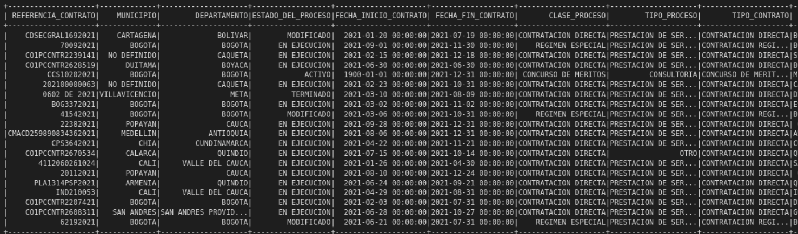
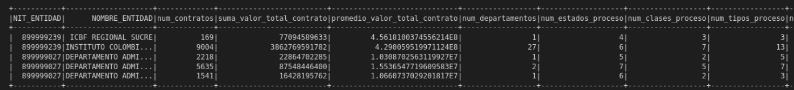

# Indicador de Justa Asignación: Riesgos y Contrataciones Irregulares en Infraestructura

_Grupo de trabajo: Alan Yovany Gasca, Christian David González, Jolman Salinas_

_Proyecto aplicado en analítica de datos_

_MIAD_

_Universidad de los Andes_

En Colombia, la contratación pública es un proceso que se realiza a través de la Agencia Nacional de Contratación Pública (ANCP), la cual es la entidad encargada de la gestión de la contratación pública en el país. La ANCP es una entidad descentralizada del orden nacional, con personería jurídica, autonomía administrativa y financiera, y patrimonio propio, que tiene como función principal la gestión de la contratación pública en el país, en los términos de la Ley 1150 de 2007 y demás normas que la modifiquen, adicionen o complementen. La ANCP es la única entidad del orden nacional que tiene la facultad de expedir normas y reglamentos para la contratación pública, así como de establecer los procedimientos y mecanismos para la gestión de la contratación pública en el país. La ANCP es la única entidad del orden nacional que tiene la facultad de expedir normas y reglamentos para la contratación pública, así como de establecer los procedimientos y mecanismos para la gestión de la contratación pública en el país.

La vigilancia de la contratación pública es el instrumento para promover la confianza en el Estado y en la administración pública, y para garantizar que los recursos públicos se utilicen de manera eficiente y transparente, prevenir que las insituciones públicas sean utilizadas para fines de corrupción y garantizar que los recursos públicos se destinen a los fines para los cuales fueron asignados es crucial para el desarrollo del país. 

La oportunidad de contar con datos abiertos sobre contratación pública en Colombia, y la posibilidad de analizarlos para responder preguntas de interés, es un reto que se debe abordar con la participación de actores públicos y privados, pero también es una oportunidad para mejorar la transparencia y la eficiencia de la contratación pública en el país mediante la aplicación de técnicas de análisis de datos y la generación de conocimiento.

> El presente proyecto busca asistir a las entidades gubernamentales de Colombia en la detección y prevención de prácticas indebidas en la asignación de contratos públicos de infraestructura. A través del análisis de datos provenientes de tres fuentes principales - SECOP Integrado, PACO y datos públicos de transparencia, lucha contra la corrupción, sanciones y multas - el objetivo es minimizar la exposición de estas entidades a contratos poco transparentes, incumplidos o corruptos.

## Proceso ETL

### Datos de contratación

Para llevar a cabo este análisis, se implementa un proceso ETL (Extracción, Transformación y Carga) que consta de varias etapas:

- **Extracción de datos**: La función read_csv_with_pyspark se utiliza para leer archivos CSV almacenados en la carpeta 'data', utilizando el separador '|'. Esta función devuelve un DataFrame de PySpark con la información del archivo CSV.

- **Análisis de calidad de datos**: La función analyze_data_quality se encarga de realizar un análisis básico de la calidad de los datos en el DataFrame proporcionado. Esto incluye el conteo de registros, registros nulos y duplicados, estadísticas descriptivas para columnas numéricas y la identificación de valores atípicos basados en el rango intercuartil.

- **Limpieza de nulos y duplicados**: La función limpiar_nulos_y_duplicados recibe un DataFrame y una lista de columnas. Esta función elimina los registros que contienen valores nulos en las columnas especificadas y también elimina los registros duplicados.

- **Filtrado de categorías de infraestructura**: Se realiza un filtrado de datos en base a las categorías de interés relacionadas con la infraestructura, como "VIVIENDA CIUDAD Y TERRITORIO", "TRANSPORTE", "MINAS Y ENERGIA" y "AMBIENTE Y DESARROLLO SOSTENIBLE".

- **Análisis de calidad de datos en el DataFrame filtrado**: Se vuelve a realizar un análisis de calidad de datos en el DataFrame filtrado para identificar posibles problemas en los datos después de la transformación.

- **Limpieza de nulos y duplicados en el DataFrame filtrado**: Se utiliza la función limpiar_nulos_y_duplicados con las columnas de referencia 'REFERENCIA_CONTRATO' y 'NIT_ENTIDAD' para eliminar registros nulos y duplicados en el DataFrame paco_secop_df. Se guarda el resultado en infraestructura_df_limpio.

- **Filtrado de los últimos años**: Se aplica la función filtrar_ultimos_anos al DataFrame infraestructura_df_limpio para conservar únicamente los registros correspondientes a los últimos 2 años. Se guarda el resultado en infraestructura_df_limpio_2_anos.

- **Selección de columnas relevantes**: Se utiliza la función seleccionar_columnas con una lista de columnas de interés (columnas_a_conservar) para reducir el número de columnas en el DataFrame infraestructura_df_limpio_2_anos. Se guarda el resultado en infraestructura_df_seleccionado.

- **Escritura de resultados en CSV**: Finalmente, el DataFrame resultante, infraestructura_df_seleccionado, se guarda en un archivo CSV llamado "contratos_infraestructura_df.csv" en la carpeta "etl_data".

  

Figura 1. Vista del DataFrame de contratos transformado

A través de este proceso ETL, se garantiza la calidad y relevancia de los datos analizados, permitiendo a las entidades gubernamentales colombianas identificar y prevenir situaciones de riesgo en la asignación de contratos públicos de infraestructura. El resultado de este análisis es un archivo CSV que contiene información detallada y depurada sobre los contratos de infraestructura en los últimos dos años, facilitando la toma de decisiones y el monitoreo de posibles irregularidades en el proceso de contratación.

### Datos de entidades

En el proceso de ETL segenera tambien un dataframe de entidades que permita perfilarlas para los análisis posteriores, para ello se implementan las siguientes funciones:

- **agregar_por_nit_entidad**: Esta función recibe un DataFrame y realiza agregaciones a nivel de entidad (NIT_ENTIDAD y NOMBRE_ENTIDAD) utilizando diversas métricas, como el número de contratos, la suma y el promedio del valor total de los contratos, el último contrato firmado, la cantidad de departamentos, estados de proceso, clases de proceso, tipos de proceso, familias y clases involucradas. La función también calcula la cantidad de meses transcurridos desde el último contrato.

- **pivotar_por_columna**: Esta función recibe un DataFrame y una columna, y realiza una operación de pivoteo en función de los valores distintos presentes en la columna especificada. El resultado es un DataFrame con una columna por cada valor distinto encontrado, y el conteo de registros por entidad para cada valor.

- **unir_dataframes**: Esta función recibe dos DataFrames y realiza una unión 'inner' entre ellos utilizando las columnas 'NIT_ENTIDAD' y 'NOMBRE_ENTIDAD' como claves de unión.

- **aggregate_multas_data**: Esta función recibe un DataFrame de multas y realiza agregaciones a nivel de entidad (nit_entidad), calculando el número de multas, la suma y el promedio del valor de las sanciones, y los meses transcurridos desde la última multa.

- **left_join_dataframes**: Esta función recibe dos DataFrames y las columnas clave para realizar una unión 'left' entre ellos.

Posteriormente, se aplican estas funciones al DataFrame infraestructura_df_seleccionado para generar un perfil detallado de las entidades involucradas en los contratos de infraestructura. Se realiza el pivoteo y la unión de los DataFrames en función de las columnas 'DEPARTAMENTO', 'ESTADO_DEL_PROCESO', 'CLASE_PROCESO', 'TIPO_PROCESO' y 'NOMBRE_CLASE', obteniendo así un DataFrame agregado y pivotado (infraestructura_df_agregado_y_pivotado) que contiene información clave sobre las entidades y su relación con los contratos de infraestructura.

  

Figura 2. Vista del DataFrame de entidades transformado

Finalmente, se realiza una unión 'left' entre el DataFrame de entidades agregado y pivotado y el DataFrame de multas agregado, utilizando la columna 'nit_entidad' como clave de unión. El resultado es un DataFrame que contiene información detallada y depurada sobre las entidades involucradas en contratos de infraestructura, incluyendo información sobre multas y sanciones, lo que facilita la toma de decisiones y el monitoreo de posibles irregularidades en el proceso de contratación.

## Reducción de dimensionalidad

En el presente estudio, nos enfrentamos al desafío de analizar un conjunto de datos voluminoso y de alta dimensión que abarca información detallada sobre las entidades gubernamentales de Colombia y los contratos públicos de infraestructura que otorgan. Dado el volumen y la complejidad de los datos, decidimos aplicar técnicas de reducción de dimensionalidad para facilitar el análisis y mejorar la eficiencia computacional sin comprometer la calidad de la información obtenida.

La reducción de dimensionalidad es un enfoque ampliamente utilizado en la ciencia de datos para simplificar conjuntos de datos de alta dimensión, conservando la mayor parte de la información relevante y manteniendo las relaciones subyacentes entre las variables. Al reducir la cantidad de características que representan a las entidades y sus contratos, nuestro objetivo es optimizar el tiempo de cálculo y mejorar la capacidad para perfilar las entidades según las características de los contratos asignados.

Para lograr esto, empleamos diversas técnicas de reducción de dimensionalidad, incluidas PCA (Análisis de Componentes Principales), LDA (Análisis Discriminante Lineal), t-SNE (Incorporación de Vecinos Estocásticos Distribuidos en T) y UMAP (Proyección Uniforme de Aproximación de Manifold), con el fin de evaluar y comparar su eficacia en función de la varianza explicada y la preservación de las relaciones de proximidad entre los puntos. A través de una cuidadosa selección de la técnica más apropiada, nos esforzamos por conservar la mayor proporción de información en el conjunto de datos reducido, permitiendo una interpretación significativa y una toma de decisiones informada en el contexto de la contratación pública en Colombia.

Al aplicar estos métodos de reducción de dimensionalidad, esperamos obtener información valiosa sobre las entidades y sus prácticas de contratación, lo que permitirá a las autoridades detectar y prevenir la exposición a prácticas poco transparentes, incumplidas o corruptas en la asignación de contratos públicos de infraestructura. Al equilibrar la necesidad de mantener la información relevante y reducir el tiempo de cómputo, este enfoque nos permite abordar de manera efectiva el problema de la transparencia y la integridad en la contratación pública, contribuyendo al desarrollo sostenible y al bienestar de la sociedad colombiana.

> El proceso de reducción de dimensionalidad es un componente clave en el proyecto de detección y prevención de prácticas indebidas en la asignación de contratos públicos de infraestructura en Colombia. Este enfoque se emplea para disminuir la complejidad del conjunto de datos, facilitando el análisis y la visualización de los patrones subyacentes en los datos. En el proyecto, se aplican diversas técnicas de reducción de dimensionalidad, como UMAP, PCA, t-SNE y LDA, para lograr este propósito.

### Importación de datos y preprocesamiento
Inicialmente, se lee el archivo CSV resultante del proceso ETL y se crea un DataFrame de pandas con la información. Luego, se aplica la función apply_standard_scaler para escalar las características numéricas y estandarizarlas, lo que facilita la comparación entre ellas.

### UMAP
Uniform Manifold Approximation and Projection (UMAP) es una técnica de reducción de dimensionalidad no lineal que permite visualizar estructuras de alta dimensión en un espacio bidimensional o tridimensional. En este caso, se emplea la función apply_umap para aplicar el algoritmo UMAP al DataFrame escalado, ajustando el modelo y transformando los datos en función de sus componentes principales. La varianza explicada por cada componente se calcula y se representa gráficamente.

### PCA
Principal Component Analysis (PCA) es una técnica lineal de reducción de dimensionalidad que busca encontrar las direcciones de mayor varianza en los datos de alta dimensión. Se aplica la función apply_pca al DataFrame escalado, ajustando el modelo PCA y transformando los datos en función de sus componentes principales. La varianza explicada acumulada se calcula y se representa gráficamente.

### t-SNE
t-Distributed Stochastic Neighbor Embedding (t-SNE) es una técnica no lineal de reducción de dimensionalidad que busca preservar las relaciones de proximidad entre los puntos en un espacio de alta dimensión. Se aplica la función apply_tsne al DataFrame escalado para ajustar el modelo t-SNE y transformar los datos en función de sus componentes principales.

### LDA
Linear Discriminant Analysis (LDA) es una técnica lineal de reducción de dimensionalidad que busca maximizar la separabilidad entre clases en un espacio de alta dimensión. Se aplica la función apply_lda al DataFrame escalado, proporcionando las etiquetas de clase y ajustando el modelo LDA. La varianza explicada acumulada se calcula y se representa gráficamente.

### Visualización en 3D
La función plot_3d se utiliza para visualizar las tres primeras componentes principales de los datos transformados en un gráfico tridimensional. Esto facilita la identificación de agrupaciones y patrones en los datos, lo que a su vez puede ser útil para detectar y prevenir prácticas indebidas en la asignación de contratos públicos de infraestructura en Colombia.

A medida que se aplican estas técnicas de reducción de dimensionalidad, es importante evaluar y comparar su eficacia en función de la varianza explicada y la capacidad para preservar las relaciones de proximidad entre los puntos. Algunas técnicas, como PCA y LDA, son lineales y pueden no ser adecuadas para capturar relaciones no lineales en los datos. Por otro lado, UMAP y t-SNE son técnicas no lineales que pueden ser más efectivas en estos casos. Sin embargo, es fundamental realizar pruebas y comparaciones exhaustivas para determinar cuál de estas técnicas es la más adecuada en función de los objetivos y las características del conjunto de datos específico.

Además, la visualización en 3D de las componentes principales resultantes puede ser útil para identificar agrupaciones y patrones en los datos. Estos patrones pueden proporcionar información valiosa para las entidades gubernamentales de Colombia que otorgan contratos públicos de infraestructura, ayudándoles a detectar y prevenir la exposición a prácticas indebidas en la asignación de contratos. En última instancia, este enfoque de reducción de dimensionalidad y análisis puede contribuir a garantizar una mayor transparencia, eficiencia y rendición de cuentas en la contratación pública en Colombia.